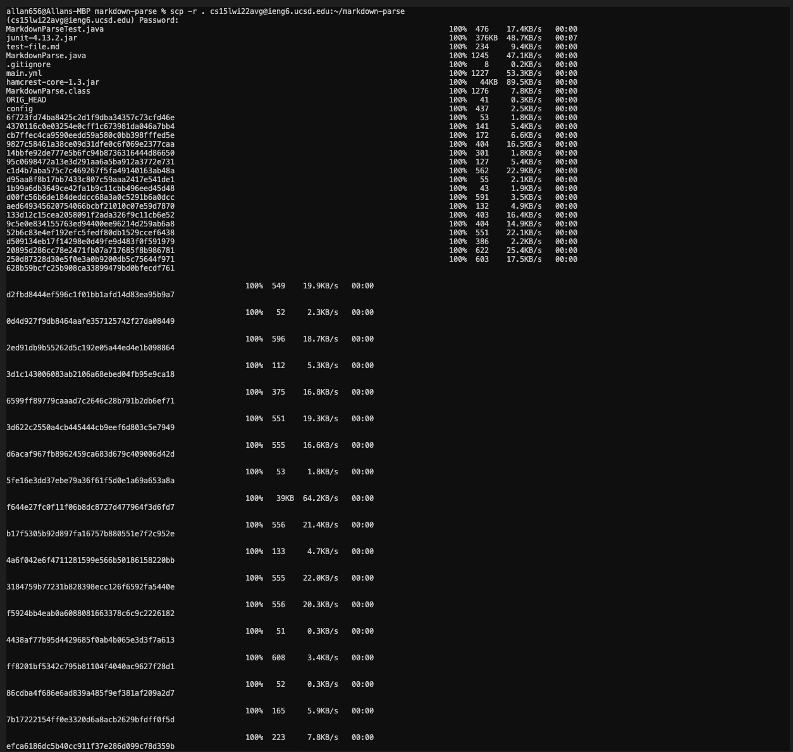
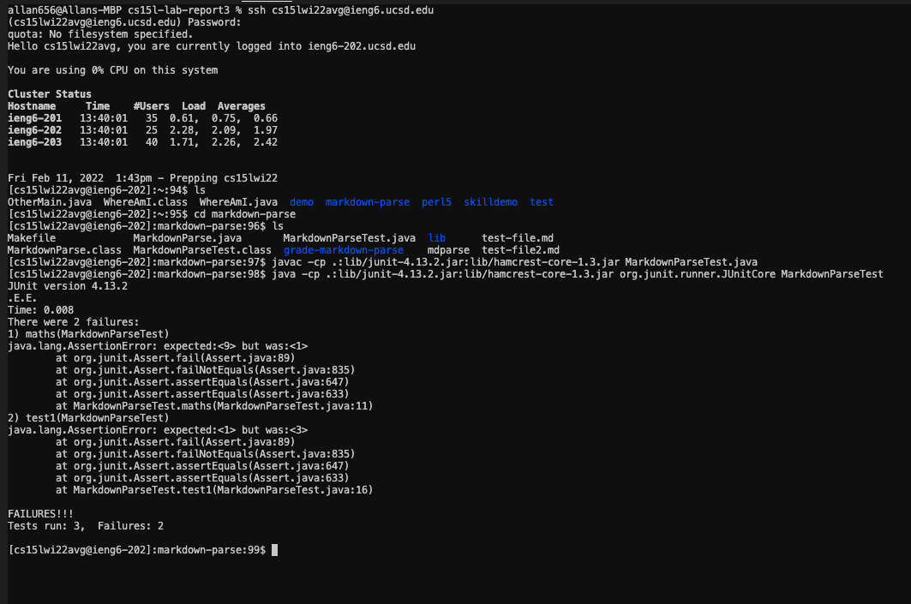

# Lab Report #3

**Lab - Copy whole directories with scp -r**

Copying markdown-parse directory onto ieng6



After typing ```scp -r```, the terminal copies the files onto the ieng6 server and saves it there. We are then able to see all the files that were copied under the original command or by typing ```ls```. 


**Running MarkdownParse on ieng6**



After using ```ssh``` to get onto the ieng6 server, we change the directory to the newly copied over MarkdownParse directory and run the test. The file properly compiles and runs. The failures of the tests are intentional. 

**Combining commands to copy and run in one line**

